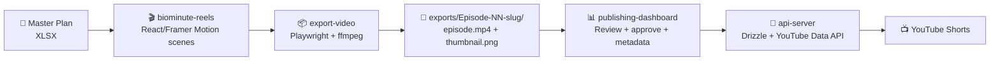

# BioMinute Shorts Studio 🎬

> AI-powered health-science YouTube Shorts production pipeline — from master plan spreadsheet to published video, fully automated.

[](VERSION.md)
[](LICENSE)
[](https://nodejs.org)
[](https://www.typescriptlang.org)
[](https://pnpm.io)
[](https://react.dev)
[](https://vitejs.dev)
[](https://expressjs.com)
[](https://orm.drizzle.team)
[](https://www.postgresql.org)

---

## What is this?

**BioMinute Shorts Studio** is a monorepo production system for the **BioMinute** health channel — a YouTube Shorts series delivering 60-second, science-backed health insights. It covers the full episode lifecycle:

```
Spreadsheet Master Plan → Animated Video Builder → MP4 Export → Review Dashboard → YouTube Publish
```

- **50 episodes** planned across **6 thematic seasons** (Jul – Nov 2026).
- Each episode is researched, scripted, animated, exported, and published through a unified toolchain.
- The pipeline is designed for **9:16 vertical** (1080×1920) YouTube Shorts.

---

## Pipeline Flow



---

## Architecture

```
biominute-shorts-studio/
├── artifacts/
│   ├── biominute-reels/        # React/Vite animated video player (9:16, 1080×1920)
│   ├── api-server/             # Express 5 REST API + Drizzle ORM (PostgreSQL)
│   ├── publishing-dashboard/   # React/Vite publishing control center
│   ├── biominute-deck/         # React/Vite investor deck
│   └── mockup-sandbox/         # Vite component preview server (design iterations)
├── lib/
│   ├── db/                     # Drizzle schema, migrations, seed data
│   ├── api-spec/               # OpenAPI 3.1 spec (source of truth)
│   ├── api-client-react/       # Auto-generated TanStack Query hooks
│   └── api-zod/                # Auto-generated Zod validation schemas
├── scripts/
│   └── src/                    # Video exporter, dashboard generator, seed reader, manual upload
├── exports/
│   ├── production-log.md       # Episode tracker (status, export folders)
│   ├── dashboard.html          # Static, self-contained live dashboard
│   └── Episode-NN-*/           # Per-episode MP4 + thumbnail + notes
├── attached_assets/
│   ├── BioMinute-Master-Workbook.xlsx   # 50-episode content bible (Production / Social / Schedule tabs)
│   ├── Logo_Youtube_*.png               # Channel logo
│   ├── Thumbnails_*.zip                 # Thumbnail source pack
│   └── fiverr-thumbnail.png           # Public gig image
└── docs/
    ├── INSTALL.md
    ├── RUN.md
    ├── USAGE.md
    ├── CONTRIBUTING.md
    ├── design-reference-neobrutalism.md
    └── bug-report-aspect-ratio.md
```

---

## Artifacts

### 🎥 BioMinute Reels (`artifacts/biominute-reels`)
Animated video player built with React 19 + Framer Motion. Each episode is made of 6 scenes rendered at 1080×1920 (9:16 vertical). The export pipeline records the running app via Playwright and merges the audio track with ffmpeg.

- **Stack:** React 19, Vite, Framer Motion, Tailwind CSS, HTML5 Audio
- **Output:** 1080×1920 MP4 @ 30fps, ~35–60 seconds per episode
- **Audio:** Background music + scene SFX are **only** part of the video reels; the dashboard and deck have no background audio

### 📊 Publishing Dashboard (`artifacts/publishing-dashboard`)
Neo-Brutalism control center for managing all 50 episodes. Stats overview, season/status filters, per-episode metadata editor, and one-click YouTube publishing.

- **Stack:** React 19, Vite, TanStack Query, Wouter, Tailwind CSS
- **Design:** Neo-Brutalism — cream `#EDEAE0`, teal `#0A6B52`, orange `#C94A00`
- **Integrations:** YouTube Data API v3

### 🔌 API Server (`artifacts/api-server`)
REST API serving the publishing dashboard and YouTube publishing flow.

- **Stack:** Express 5, Drizzle ORM, PostgreSQL, Zod, Pino
- **Endpoints:** `GET /api/episodes`, `PATCH /api/episodes/:id`, `POST /api/episodes/:id/approve`, `POST /api/youtube/publish/:id`, `GET /api/youtube/status`, `POST /api/episodes/:epNumber/publish-now`
- **Auth:** Session-based (`SESSION_SECRET`), YouTube OAuth2 refresh token flow
- **Scheduler:** Every 15 minutes, auto-uploads scheduled episodes whose time has arrived

### 📑 BioMinute Deck (`artifacts/biominute-deck`)
Investor/presentation deck built as a React web app. Slide content is driven by `src/data/slides-manifest.json`.

---

## Episode Plan

| Season | Theme | Episodes | Dates |
|--------|-------|----------|-------|
| S1 | Morning Habits | Ep 1–6 | Jul 13 – Jul 23, 2026 |
| S2 | Movement & Body | Ep 7–12 | Jul 25 – Aug 4, 2026 |
| S3 | Sleep & Recovery | Ep 13–18 | Aug 6 – Aug 16, 2026 |
| S4 | Stress & Mind | Ep 19–24 | Aug 18 – Aug 28, 2026 |
| S5 | Nutrition & Myths | Ep 25–30 | Aug 30 – Sep 11, 2026 |
| S6 | Healthy Aging & Longevity | Ep 31–36 | Sep 13 – Sep 25, 2026 |
| S7 | Extended queue | Ep 37–50 | Sep 27 – Nov 10, 2026 |

Every episode row in the master workbook contains: hook title, VO script, visual direction, thumbnail prompt, BGM/SFX notes, hashtags, YouTube title, post-ready description, and post date.

---

## Quick Start

```bash
# 1. Install all workspace dependencies
pnpm install

# 2. Push the DB schema and seed episodes
pnpm --filter @workspace/db push-force
pnpm --filter @workspace/scripts exec tsx ./src/seed-episodes.ts

# 3. Start the artifacts (in separate terminals)
pnpm --filter @workspace/api-server run dev
pnpm --filter @workspace/publishing-dashboard run dev
pnpm --filter @workspace/biominute-reels run dev
```

See [`docs/INSTALL.md`](docs/INSTALL.md) and [`docs/RUN.md`](docs/RUN.md) for the full setup.

---

## Available Options & Commands

| Command | Description |
|---------|-------------|
| `pnpm install` | Install all workspace dependencies |
| `pnpm run typecheck` | TypeScript check across all packages |
| `pnpm run build` | Build all packages |
| `pnpm --filter @workspace/api-server run dev` | Start the API server |
| `pnpm --filter @workspace/publishing-dashboard run dev` | Start the publishing dashboard |
| `pnpm --filter @workspace/biominute-reels run dev` | Start the video player |
| `pnpm --filter @workspace/biominute-deck run dev` | Start the investor deck |
| `pnpm --filter @workspace/db push-force` | Push Drizzle schema to the database |
| `pnpm --filter @workspace/scripts exec tsx ./src/seed-episodes.ts` | Seed episodes from the master workbook |
| `pnpm --filter @workspace/scripts exec tsx ./src/upload-now.ts <ep>` | Manually upload an episode immediately |
| `pnpm run export-video` | Export the current episode to MP4 (also regenerates dashboard) |
| `pnpm --filter @workspace/scripts exec tsx ./src/verify-export.ts <path>` | Verify MP4 resolution is 1080×1920 |
| `pnpm run dashboard:generate` | Regenerate `exports/dashboard.html` from the database |

---

## Environment Secrets

| Secret | Purpose | Required |
|--------|---------|----------|
| `DATABASE_URL` | Primary PostgreSQL connection string (Neon) | For API server |
| `DATABASE_URL_UNPOOLED` | Direct Neon connection for migrations / admin | For schema pushes |
| `PGHOST`, `PGPORT`, `PGUSER`, `PGPASSWORD`, `PGDATABASE` | Built-in Replit Postgres fallback | Optional |
| `SESSION_SECRET` | Express session signing | Yes |
| `GITHUB_TOKEN` | Push exports to GitHub (classic PAT, `repo` scope) | For auto-push |
| `YOUTUBE_CLIENT_ID` | YouTube OAuth2 client ID | For publishing |
| `YOUTUBE_CLIENT_SECRET` | YouTube OAuth2 client secret | For publishing |
| `YOUTUBE_REFRESH_TOKEN` | Long-lived refresh token for YouTube API | For publishing |

Set all secrets via Replit's Secrets manager (never commit to `.env`).

---

## Tech Stack

| Layer | Technology |
|-------|------------|
| Runtime | Node.js 24 |
| Language | TypeScript 5.9 |
| Package manager | pnpm workspaces |
| Video renderer | React 19 + Framer Motion |
| Build tool | Vite 7 |
| API framework | Express 5 |
| ORM | Drizzle ORM |
| Database | PostgreSQL (Neon primary, Replit fallback) |
| Validation | Zod (auto-generated from OpenAPI) |
| API client | TanStack Query (auto-generated hooks) |
| Styling | Tailwind CSS v4 |
| Video export | Playwright + Xvfb + ffmpeg |
| YouTube integration | YouTube Data API v3 |
| Logging | Pino |

---

## Documentation

- [`docs/INSTALL.md`](docs/INSTALL.md) — detailed installation and secrets setup
- [`docs/RUN.md`](docs/RUN.md) — how to run every artifact and workflow
- [`docs/USAGE.md`](docs/USAGE.md) — full production workflow from plan to publish
- [`docs/CONTRIBUTING.md`](docs/CONTRIBUTING.md) — bug report / suggestion form and known issues
- [`docs/design-reference-neobrutalism.md`](docs/design-reference-neobrutalism.md) — brand/design system reference
- [`docs/bug-report-aspect-ratio.md`](docs/bug-report-aspect-ratio.md) — aspect-ratio bug report (resolved)
- [`VERSION.md`](VERSION.md) — version history

---

## Project Status

- ✅ Episodes 1–36: Exported, logged in `exports/production-log.md`, and seeded in the database
- ✅ Episodes 1–4: Published to YouTube
- ✅ Episodes 5–36: Scheduled for daily posting at 09:00 UTC on their post dates
- ✅ Publishing dashboard: Live with Neo-Brutalism UI, full CRUD + YouTube publish
- ✅ API server: Running with full OpenAPI spec, duplicate-upload guard, and canonical description template
- ✅ Database: 36 episodes seeded; 50-episode master workbook in place
- ✅ Static dashboard: `exports/dashboard.html` reflects live DB state
- 🔄 Test episodes `TEST-1` and `TEST-2` reserved for pipeline smoke tests
- 🔄 GitHub Pages: ready to deploy from `main` root

---

## License

MIT © BioMinute Studio
